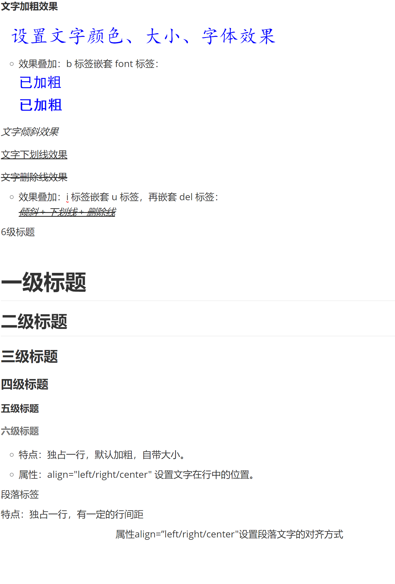

## 文字标签

1. <b>文字加粗效果</b>

2. <font color="blue" size="6" face="楷体"> 设置文字颜色、大小、字体效果</font>
   - 效果叠加：b 标签嵌套 font 标签：
     <font color="blue" size="5" face="黑体">已加粗</font>
     <b><font color="blue" size="5" face="黑体">已加粗</font></b>

3. <i>文字倾斜效果</i>

4. <u>文字下划线效果</u>

5. <del>文字删除线效果</del>

   - 效果叠加：i 标签嵌套 u 标签，再嵌套 del 标签：
     <i><u><del>倾斜 + 下划线 + 删除线</del></u></i>

6. 6级标题 

   

   <h1>一级标题</h1>
   <h2>二级标题</h2>
   <h3>三级标题</h3>
   <h4>四级标题</h4>
   <h5>五级标题</h5>
   <h6>六级标题</h6>

   * 特点：独占一行，默认加粗，自带大小。
   * 属性：align="left/right/center" 设置文字在行中的位置。

7. <p>段落标签</p>
   <p>特点：独占一行，有一定的行间距</p>
   <p align="center">
       属性align=”left/right/center"设置段落文字的对齐方式
   </p>

上述效果如下图：



---

* 在html中，空格的出现是为了英文单词的拆分使用的，所以只允许显示一个空格。即使我们在代码中写出再多的空格，也会被折叠成1个空格，那么我们想要多个空格怎么办？**使用转义字符  \&nbsp;**。比如：**我&nbsp;&nbsp;真&nbsp;&nbsp;&nbsp;的好生气。**
* **\&lt;**          代替一个 < 
* **\&gt;**         代替一个 >
* **\<br/>**       代表一个换行

---

<marquee> 移动文字，有很多的属性，说其中两个：
      direction="left/right/up/down" 文字移动的方向
      scrollamount="数值" 文字移动的速度

```html
<html>
    <body>
        <marquee direction="right" scrollamount="20">文字移动</marquee>
    </body>
</html>
```

