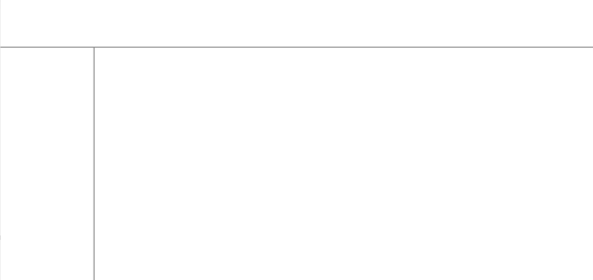

## 框架集标签

- 框架集标签：<frameset> + <frame>
  <frameset> 将当前窗口横纵分成n个子窗口区域
  <frame> 用来填充每一个子窗口区域（子窗口），通过请求来展示网页内容等。

- 编写html时，<frameset>要替代<body>。
          也就是说，要么有<frameset> 要么有 <body> 不能同时有。因为<body>是要展示自己写的内容，而<frameset>是要请求展示的内容。

- <frameset> 只是将当前窗口横纵分成n个子窗口区域：

  - <frameset rows="100, 120, *"> 将当前窗口纵向分成3份，3个子窗口的高度分别是100，120和剩余。
  - <frameset cols="100, 120, *"> 将当前窗口纵向分成3份，3个子窗口的宽度分别是100，120和剩余。
  - <frameset rows="" cols=""> 横纵都分。

- <frame> 就是用来填充每个子窗口的内容的：

  - 根据<frameset> 设计的子窗口区域数量，配合对应数量的<frame> 子窗口。
  - <frame src="网页路径" /> 请求当前子窗口要展示的网页内容。

  ```html
  <html>
  
  <head>
      <title>框架集标签</title>
  </head>
  <!-- 使用框架集标签取代body -->
  <frameset rows="200, 200, *">
      <!-- 配合对应数量的<frame/> -->
      <!-- 通过src属性请求展示内容 -->
      <frame src="http://wwww.jd.com" />
      <frame src="http://wwww.baidu.com" />
      <frame src="http://wwww.taobao.com" />
  </frameset>
  
  </html>
  ```

  ---

- 超链接与框架集之间的配合使用

  - <frame name="frameName" /> 自定义子窗口名字。
  - <a target="frameName"> 请求到的网页内容，在指定的窗口中展示。
  - <a target="_parent" > 请求到的网页内容在父级窗口展示。 

- 拓展：

  - <frame noresize="noresize" /> 设置窗口不能调整大小
  - <frame frameboarder="0/1" /> 设置子窗口间的分隔条是否显示

  ```html
  <html>
      <body>
          <a href="http://www.taobao.com" target="right">淘宝</a>
          <br/><br/>
          <a href="http://www.taobao.com" target="_parent">淘宝2</a>
      </body>
  </html>
  ```

  ```html
  <html>
      <head>
          <title>框架集和超链接</title>
      </head>
      <frameset cols="200, *">
          <!-- noresize属性设置窗口不可变 -->
          <frame src="03-2引入.html" noresize="noresize"/><!--左窗口,展示"03-2引入.html"-->
          <frame name="right" /><!--右窗口,展示target效果-->
      </frameset>
  </html>
  ```

- 扩展：

  - 横纵嵌套使用

  ```html
  <html>
      <head>
          <title>框架集嵌套</title>
      </head>
      <frameset rows="100, *">
          <frame />
          <!-- 再做拆分 -->
          <frameset cols="200, *">
              <frame />
              <frame />
          </frameset>
      </frameset>
  </html>
  ```

  

