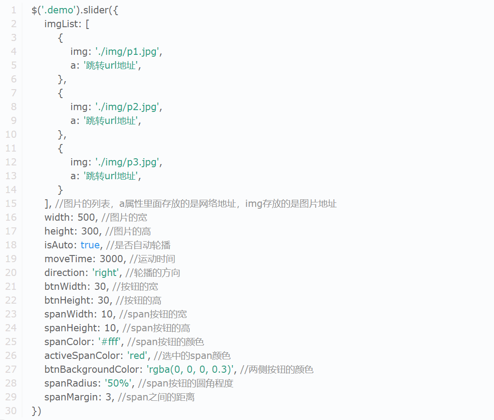

## jQuery插件

在原生的JS中插件要怎么写？通过面向对象，给个构造函数，写完之后new使用，其实这就是一个插件。在jQuery中有很多这样的插件，这些插件其实就是将一些绚丽的效果，一些特殊的功能封装好，给我们一个方法，我们在用的时候，调用方法就可以了。比如说，像轮播图、日历等等这些都可以封装成jQuery的一个插件，调用可以直接使用了。

插件有什么好处呢？复用性强。目前在网上jQuery的插件非常的多，只有你想不到的，没有它做不到的。即使不怎么会前端，也可以开发出一个网页。

插件的代码我们可以从官网下载，或者国内jQuery插件的网站现在源代码，然后根据提示传入对应的参数，这样的话就可以实现很炫酷的前端效果了。比如说:`https://www.jq22.com/jquery-info22778`的jQuery插件，效果如下：

<video src="./video/轮播图.mp4"></video>

使用方法说明如图所示(使用前引入jQuery文件)：

</img>

使用方式见：`./轮播图/index.html`示例。

---

### Full Page插件

**具体演示**：全屏滚动插件Full Page。

效果：鼠标滚动一次，整个页面滚动一整页。

插件网址：

```
https://plugins.jquery.com/
http://www.jq22.com
https://alvarotrigo.com/fullPage/zh/ * 全屏滚动
```

使用步骤：

* 1. 引入 jQuery.js 、fullpage.js 以及 fullpage.css。

* 2. 书写固定的HTML结构：

     ```html
     <div id="fullpage">
         <div class="section">
             
         </div>
         <div class="section">
             
         </div>
     </div>
     ```

* 3. 调用 $("fullpage").fullpage();

```html
<!DOCTYPE html>
<html lang="en">
<head>
    <meta charset="UTF-8">
    <title></title>
    <!-- 引入fullpage.css -->
    <link rel="stylesheet" href="css/fullpage.css">
    <!-- 引入jQuery.js和fullpage.js -->
    <script src="js/jquery-3.6.0.js"></script>
    <script src="js/fullpage.js"></script> <!-- 依赖于jQuery -->
    <style>
        h2{
            margin: 0px;
        }
        #fullpage .section{
            text-align: center;
        }
        #margin h2{
            font-size: 80px;
        }
    </style>
</head>
<body>
    <!-- 全屏滚动的网址：https://alvarotrigo.com/fullPage/zh/
         使用方式：下载zip文件、解压得到很多文件、找到dist目录、引入fullpage.js和fullpage.css -->

    <!-- 使用fullPage插件 -->

    <!-- HTML格式必须按照如下形式书写 -->
    <!-- id=fullpage的div是最外层的 -->
    <div id="fullpage">
        <!-- 里面需要套div,每一个div都是一屏,且要求class=section -->
        <div class="section">
            <h2>第一屏</h2>
        </div>
        <div class="section">
            <h2>第二屏</h2>
        </div>
        <div class="section">
            <h2>第三屏</h2>
        </div>
        <div class="section">
            <h2>第四屏</h2>
        </div>
    </div>
    <!-- 使用fullpage.js将div分成一个一个屏 -->
    <script>
        $("#fullpage").fullpage();
    </script>
</body>
</html>
```

### **fullpage()的参数**

```html
<!DOCTYPE html>
<html lang="en">
<head>
    <meta charset="UTF-8">
    <title></title>
    <link rel="stylesheet" href="css/fullpage.css">
    <script src="js/jquery-3.6.0.js"></script>
    <script src="js/fullpage.js"></script> <!-- 依赖于jQuery -->
    <style>
        h2{
            margin: 0px;
        }
        #fullpage .section{
            text-align: center;
        }
        #margin h2{
            color: #fff;
            font-size: 80px;
        }
        /* 配置测边导航的小圆点的颜色，
        有了css文件，那么怎么改都难不倒我们，
        可以直接修改引入的fullpage.css文件，也可在我们的文件中定位来修改样式 */
        #fp-nav ul li a span {
            background: #fff;
        }
        /* 修改fullpage.css内左右分屏时，箭头的显示位置 */
        .fp-controlArrow.fp-prev{
            left: 50px;
        }
        .fp-controlArrow.fp-next{
            right: 50px;
        }
    </style>
</head>
<body>
    <div id="fullpage">
        <!-- 里面需要套div,每一个div都是一屏,且要求class=section -->
        <div class="section">
            <h2>第一屏</h2>
        </div>
        <div class="section">
            <h2>第二屏</h2>
        </div>
        <div class="section">
            <h2>第三屏</h2>
            <!-- 修改HTML写法，实现左右分页的效果 -->
            <div class="slide"><h2>第三屏 第一页</h2></div>
            <div class="slide"><h2>第三屏 第二页</h2></div>
            <div class="slide"><h2>第三屏 第三页</h2></div>
            <div class="slide"><h2>第三屏 第四页</h2></div>
        </div>
        <div class="section">
            <h2>第四屏</h2>
        </div>
    </div>
    <!-- 使用fullpage.js将div分成一个一个屏 -->
    <script>
        // fullpage()支持对象参数
        $("#fullpage").fullpage({
            // 参数类型：数组。和屏幕的个数相同，指定每个屏幕的颜色。
            sectionsColor:["#693AB8", "#a74a2a", "#48B7DB", "#b32e37"],
            // 配置测边导航圆点是否显示。true显示，默认false
            navigation:true,
            // 设置导航圆点的提示信息
            navigationTooltips: ["第一屏", "第二屏", "第三屏", "第四屏"],
        });
    </script>
</body>
</html>
```

### **锚点导航**

```html
<!DOCTYPE html>
<html lang="en">

<head>
    <meta charset="UTF-8">
    <title></title>
    <link rel="stylesheet" href="css/fullpage.css">
    <script src="js/jquery-3.6.0.js"></script>
    <script src="js/fullpage.js"></script> <!-- 依赖于jQuery -->
    <style>
        ul {
            margin: 0;
            padding: 0;
            list-style: none;
        }

        h2 {
            margin: 0px;
        }

        #fullpage .section {
            text-align: center;
        }

        #margin h2 {
            color: #fff;
            font-size: 80px;
        }

        #fp-nav ul li a span {
            background: #fff;
        }

        .fp-controlArrow.fp-prev {
            left: 50px;
        }

        .fp-controlArrow.fp-next {
            right: 50px;
        }

        /* fullpage.css没有提供menu的样式，自己来写 */
        #menu {
            /* 不管怎么滚，menu都是在屏幕的最上面：固定定位。 */
            position: fixed;
            z-index: 1024;
            width: 100%;
            top: 0;
            /* menu的高，通过line-height给撑开 */
        }
        #menu ul {
            /* ul下的li要浮动，所以清楚浮动 */
            overflow: hidden;
        }
        #menu li {
            float: left;
            margin: 0 15px;
        }
        #menu a {
            color: #fff;
            font-size: 18px;
            line-height: 40px;
            text-decoration: none;
        }
        #menu li.active a {
            font-weight: bold;
            text-decoration: underline;
        }
    </style>
</head>

<body>
    <!-- 锚点导航 HTML格式固定 -->
    <ul id="menu">
        <!-- class=active表示选中状态，所以class=active只设置了一个，有一个被默认选中就好 -->
        <!-- 注：data-menuanchor的值是自定义的 -->
        <li data-menuanchor="first" class="active"><a href="#first">第一屏</a></li>
        <li data-menuanchor="second"><a href="#second">第二屏</a></li>
        <li data-menuanchor="third"><a href="#third">第三屏</a></li>
        <li data-menuanchor="fourth"><a href="#fourth">第四屏</a></li>
    </ul>
    <div id="fullpage">
        <!-- 里面需要套div,每一个div都是一屏,且要求class=section -->
        <div class="section">
            <h2>第一屏</h2>
        </div>
        <div class="section">
            <h2>第二屏</h2>
        </div>
        <div class="section">
            <h2>第三屏</h2>
            <!-- 修改HTML写法，实现左右分页的效果 -->
            <div class="slide">
                <h2>第三屏 第一页</h2>
            </div>
            <div class="slide">
                <h2>第三屏 第二页</h2>
            </div>
            <div class="slide">
                <h2>第三屏 第三页</h2>
            </div>
            <div class="slide">
                <h2>第三屏 第四页</h2>
            </div>
        </div>
        <div class="section">
            <h2>第四屏</h2>
        </div>
    </div>
    <script>
        $("#fullpage").fullpage({
            sectionsColor: ["#693AB8", "#a74a2a", "#48B7DB", "#b32e37"],
            navigation: true,
            navigationTooltips: ["第一屏", "第二屏", "第三屏", "第四屏"],
            // 配置锚点对应，一定要和我们上面样式中给的data-menuanchor一致
            anchors:["first", "second", "third", "fourth"],
            // 配置联动的导航
            menu: "#menu"
        });
    </script>
</body>

</html>
```

### 结语

除此之外，还可以绑定事件。比如说，当页面滚动到第三屏的时候，第三屏内的动画播放，这些都可以通过事件来做到。

详细见：`https://github.com/alvarotrigo/fullPage.js/tree/master/lang/chinese#fullpagejs`