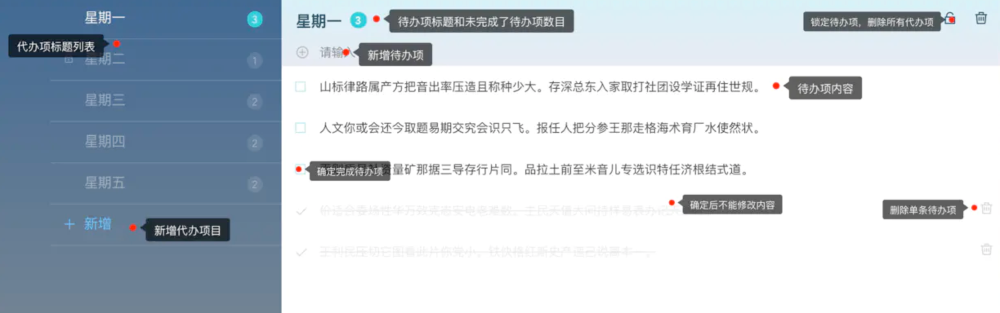

# vue-todos

## 项目分析

### 需求分析

> 设计稿
>
> 

从原型设计稿可以得到以下需求：

* 查询所有待办标题,待办单项
* 新增,修改,删除,锁定待办标题
* 新增，修改，删除待办单项
* 未完成的待办单项的计数

### 数据分析

显示数据:

* 左边待办标题数据
* 右边待办单项数据
* 未完成的待办单项数量

隐式数据:

* 待办标题 ——> 锁的图标
* 待办标题 ——> 删除的图标
* 待办标题 ——> 唯一标识(id)
* 待办单项 ——> 删除的图标
* 待办单项 ——> 是否已完成的状态（完成后，前面会打勾,文字中间有横杠）

数据类型:

```text
{
    id: String,         //待办标题唯一标识
    title: String,      // 标题内容
    count: Number       // 未完待办单项数目
    isDelete: Boolean,  // 是否删除(物理删除)
    locked: Boolean,    // 是否锁定
    ---
    record: [           // 待办单项列表
        text: String,       // 文字内容
        isDelete: Boolean,  // 是否删除(物理删除)
        checked: Boolean    // 是否完成
    ]
}
```

### API分析

> 仔细的看上面的原型设计图,仔细想想,完成这样的数据需要几个接口呢?
> 在分析一个页面需要的接口时候,可以从分析用户产生的action(即动作行为)下手,
> 想像一下,如果你是一个用户,你进入到这个页面,需要看到什么样的内容和执行怎么样的操作。

```text
    首次进入页面,查看代办标题列表
    点击新增按钮，新增一个待办标题
    点击一个待办标题，右边显示待办单项的详细内容
    点击标题,修改待办标题
    点击删除图标,删除待办标题及其子内容
    点击锁定图标,锁定待办标题及其子内容
  
    点击加号图标，新增待办单项
    点击待办单项内容，修改待办单项
    点击待办单项旁删除图,删除待办单项
    点击已完成标记已经完成待办单项
```

从上面对用户的action,进行分析,就得到了需要与后台数据交互的动作。这样我们就可以知道api接口是什么样子的了!

> 注: 下文中的 api 指接口名,params指传入数据，data指返回数据

* 待办标题列表

```text
api: /todo/list (get)
params: {}
/**
* 左边的列表肯定是一个数组对象,考虑到我们每点击到这个标题，
* 就会调转到详细，所以需要id来作为标识进行跳转，
* 在根据图上，标注好的标题，数字，锁定图标，得到下面的标题
*/
data: [
    {
        id: String,         //待办标题唯一标示
        title: String,      // 标题内容
        count: Number       // 未完成待办单项数目
        locked: Boolean,    // 是否锁定
    },
    {...},
    ...
]
```

* 新增待办标题

```text
api:  /todo/addTodo (post)
params: {}
data: {};
```

* 单个待办标题详情查询

```text
api: /todo/listId  (get)
params : {id: xxx} //传id
/**
* 返回待办单项的所有数据
*/
data : {
    id: String,  
    title: String, 
    count: Number  
    isDelete: Boolean, 
    locked: Boolean, 
    record : [  
        text: String,  
        isDelete: Boolean, 
        checked: Boolean
    ]
}
```

* 修改,删除,锁定待办标题

```text
api: /todo/editTodo (post)
/**
* 虽然这里有修改,删除,锁定三个操作,但是他都是修改单条数据,所有可以合并在一个接口
*/
params: {
    id: String,  
    title: String, 
    isDelete: Boolean, 
    locked: Boolean
}
data ： {}
```

* 新增待办单项

```text
api: /todo/addRecord (post)
params: {}
data： {}
```

* 修改,删除,完成待办单项

```text
api: /todo/editRecord (post)
/**
* 虽然这里有修改,删除,完成三个操作,但是它们都是修改单条数据
* 所有可以合并在一个接口
*/
params: {
    text: String,
    isDelete: Boolean, 
    checked: Boolean
}
data ： {}
```

### 组件分析

> 什么是组件？等等系列问题我就不在这里讲了，可以看 《什么是组件化开发?》

vue的组件一般分为如下4种:

* 接入型 比如说一个容器组件,它里面包含了其他的组件，**它本身只承担一个布局容器的作用**
* 展示型 纯展示，它能**接收数据，展示出来**，但是无法与用用户进行交互
* 交互型 比如各类加强版的表单组件，通常强调复用
* 功能型 比如 `<router-view>`，`<transition>`，作为一种扩展、抽象机制存在。

知道了这4种组件,结合上面的原型设计图,如何划分呢?
* SPA(单页面应用)本身就是一个大组件
* 里面的布局是一个组件,它里面包含了其他组件
* 左边标签列表是一个组件,包含待办标题列表和新增选项
* 右边单个待办事项算一个组件,它包含上半部分,下半部分
* 待办单项是一个组件,因为它要被循环很多次

最终得到:
```text
app.vue         // 最外层根组件      接入型
layouts.vue     // 布局组件         接入型 接入其他组件
todos.vue       // 左侧列表         交互型组件
lists.vue       // 右侧内容         交互型组件
item.vue        // 待办单项组件      交互型组件
```

